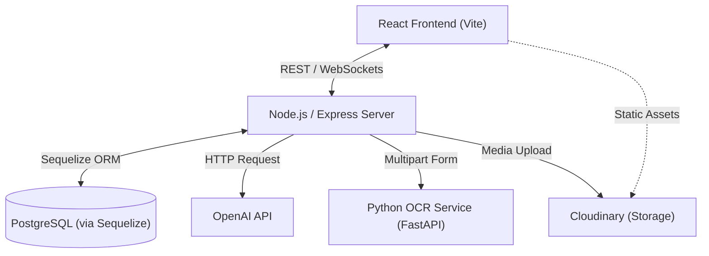

# AI Symptom Checker: Project Blueprint & Study Guide

Welcome to the detailed study guide for the **AI Symptom Checker**. This document breaks down the complex architecture and the elegant logic used to power this modern medical assistant application.

---

## 1. System Architecture

The project follows a **Micro-service oriented Monolith** pattern. While the core logic resides in a Node.js server, specialized tasks (like OCR) are offloaded to a dedicated Python service.

---

## 2. The Technology Stack

| Layer | Technology | Purpose |
| :--- | :--- | :--- |
| **Frontend** | **React 18** | A component-based UI library for building dynamic user interfaces. |
| **Bundler** | **Vite** | An extremely fast build tool and development server. |
| **Styling** | **Vanilla CSS** | Custom CSS variables and animations for a premium, lightweight design. |
| **Backend** | **Node.js / Express** | Handles API routing, business logic, and server-side orchestration. |
| **Database** | **PostgreSQL** | A powerful, open-source relational database for structured data. |
| **ORM** | **Sequelize** | Maps Javascript objects to SQL tables for easier database management. |
| **AI** | **OpenAI (GPT-3.5)** | Powers the symptom analysis and medical advice logic. |
| **OCR** | **FastAPI + EasyOCR** | A Python microservice that extracts text from medical images/PDFs. |
| **Real-time** | **Socket.io** | Enables instant, live chat functionality between users/system. |

---

## 3. Core Component Analysis

### Frontend (Client)
- **State Management**: Uses the **Context API** (`AuthContext.jsx`, `ThemeContext.jsx`) to handle global user authentication and dark/light mode themes consistently across the app.
- **Routing**: `react-router-dom` manages navigation, including **Protected Routes** that ensure only logged-in users can access the Dashboard or Upload pages.
- **Key Pages**:
    - [Dashboard.jsx](file:///d:/ai%20symptom%20checker/client/src/pages/Dashboard.jsx)
    - [RecordUpload.jsx](file:///d:/ai%20symptom%20checker/client/src/pages/RecordUpload.jsx)
    - [SymptomChecker.jsx](file:///d:/ai%20symptom%20checker/client/src/pages/SymptomChecker.jsx)

### Backend (Server)
- **Models**:
    - [User.js](file:///d:/ai%20symptom%20checker/server/models/User.js)
    - [MedicalRecord.js](file:///d:/ai%20symptom%20checker/server/models/MedicalRecord.js)

---

## 4. Key Implementation "Ideas"

### A. The Record Processing Pipeline
1. **Upload**: User submits a file.
2. **Cloud Storage**: Node.js sends the file to **Cloudinary**.
3. **Extraction**: Simultaneously, the server sends the file to the **OCR Microservice**.
4. **Processing**: Python (EasyOCR) extracts text.
5. **Persistence**: Node.js saves the metadata to **PostgreSQL**.

### B. AI Orchestration
The [aiController.js](file:///d:/ai%20symptom%20checker/server/controllers/aiController.js) uses **Prompt Engineering** to instruct the AI to return data in a strict JSON format, which the frontend can then parse and display beautifully.

---

## 5. Study Tips for This Project

1. **Follow the Trace**: Pick a route and follow the code from Frontend -> Route -> Controller -> Database.
2. **Experiment with Prompts**: Change the prompt in `aiController.js` to see how it affects the AI.
3. **Understand the Async Flow**: Study how `async/await` is used throughout the project.

---
> [!TIP]
> **Modern Best Practice**: Keep your API keys in `.env` files and never share them!
